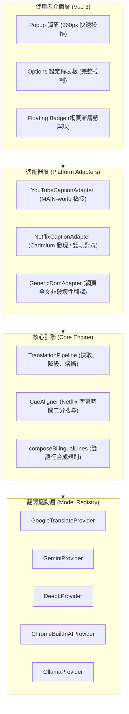

<div align="center">

# 🌐 Open Web Translate (v3)

**次世代在地化、隱私優先、AI 驅動的開源網頁與串流影音雙語翻譯神器**  
*An open-source, Local-first, AI-extensible translation and language learning workbench.*

[](./LICENSE)
[](https://vuejs.org/)
[](https://www.typescriptlang.org/)
[](https://wxt.dev/)
[](https://github.com/)
[](https://github.com/)

[功能特點](#-核心功能) • [支援引擎](#-多引擎-ai-翻譯核心) • [快捷鍵指南](#-影音學習快捷鍵) • [本地開發](#-本地開發與安裝) • [隱私架構](#-隱私與安全模型)

</div>

---

## 📖 簡介

**Open Web Translate (OWT)** 是一款專為現代瀏覽體驗打造的開源雙語翻譯與語言學習擴充套件。無論是瀏覽外文資訊、在 **YouTube** 上觀看科技演講或外語歌曲、亦或在 **Netflix** 追劇學外語，OWT 都能提供極致絲滑、版面零破壞的沉浸式雙語體驗。

底層採用 **WXT + Vue 3 + TypeScript** 現代化擴充架構，全面支援 **Chrome (Manifest V3)** 與 **Firefox (Manifest V2)** 雙瀏覽器。

---

## ✨ 核心功能

### 🎬 1. YouTube 深度雙語字幕
- **播放器底層原生掌控**：直接與 YouTube 播放器核心 API（`#movie_player`）對接，擺脫被動 DOM 爬取。
- **原文字幕強效優先判定**：動態偵測影片語言，自動繞過 YouTube 預設的拙劣二次機器翻譯，**強制優先選取作者原汁原味的原文字幕**（如日文、英文等）。
- **字幕去重防護**：當原文字幕已為目標語言時，自動防護為單行顯示，徹底避免畫面上出現兩行一模一樣的中文。
- **三種顯示模式**：支援「雙語對照」、「譯文優先」、「純譯文沉浸」自由切換。
- **彈窗快速切換軌道**：在外掛彈窗即可即時讀取影片全部 CC 軌道，一鍵隨意切換來源語言。

### 🍿 2. Netflix 零延遲雙語字幕與語言學習
- **三重軌道發現引擎**：結合 `JSON.parse` 短路補丁、`fetch` 複製攔截與 `Cadmium` 播放器輪詢，瞬間載入雙語字幕。
- **雙軌時間對齊演算法（`CueAligner`）**：以播放頭二分搜尋，動態計算最大時間重疊，完美對齊雙語字幕。
- **原生字幕無閃爍遮罩**：原生遮罩避免字幕更迭時的白底黑字閃爍。
- **單詞點擊即查（`DictionaryPopover`）**：在字幕上直接點擊單字即可即時查詢字義，一鍵收藏至生詞本。
- **逐句精細控制**：支援句尾自動暫停、單句重播，打造超越 Language Reactor 的學習體驗。

### 🌐 3. 全網頁雙語對照與劃詞翻譯
- **非破壞性排版**：採用智慧 DOM 區塊擷取與 Shadow DOM 樣式隔離，保留網頁原有排版與行內樣式。
- **質感漸層懸浮球（Draggable Floating Ball）**：
  - 具備「閒置（半透明） / 翻譯中（微光旋轉） / 已完成（青綠徽章）」三態指示。
  - 支援自由拖曳並自動記憶於本機端位置，點擊即開關翻譯。
- **快捷劃詞翻譯**：選取網頁任何段落即浮現快捷翻譯膠囊與右鍵選單。

### 🎨 4. 極致美學設計系統
- **Obsidian Glass（黑曜石琉璃風）** 與 **Clean Ceramic（白陶瓷極簡風）**：支援深色、淺色與跟隨系統自動切換。
- **雙面板架構**：
  - **Popup 彈窗**：極致緊湊的 360px 快速操作中心（開關、翻譯引擎切換、語言切換、字幕快捷控制）。
  - **Options 儀表板**：完整視窗工作台（各 AI 引擎金鑰配置、自訂提示詞、生詞本管理與 CSV/Anki 匯出）。

---

## 🧠 多引擎 AI 翻譯核心

OWT 內建強大的翻譯管線（`TranslationPipeline`），支援隨時在彈窗即時切換翻譯服務：

| 翻譯引擎 | 類型 | 特點與說明 |
|---|---|---|
| **Google 翻譯** | 免費免金鑰 | 內建連線頻率控制（Concurrency Limiter）與自動重試，開箱即用 |
| **Google Gemini AI** | 雲端大模型 | 支援 `gemini-2.5-flash`、`gemini-3.5-flash`，具備對話記憶上下文（Context）與智慧熔斷機制 |
| **DeepL 翻譯** | 專業翻譯 API | 支援 DeepL Free 與 Pro API 金鑰，翻譯自然度高 |
| **Chrome 內建 AI** | 瀏覽器本機端 | 支援 Chrome 實驗性本機 Gemini Nano，無網路連線亦可極速翻譯 |
| **Ollama** | 自託管本機模型 | 支援連線本機端 `localhost:11434` 執行 LLaMA 3、Mistral 等開源模型 |
| **自訂 HTTP API** | 企業 / 代理 | 相容 OpenAI Chat Completions 規範之自訂端點 |

---

## ⌨️ 影音學習快捷鍵

在 Netflix 串流播放器啟用時，可使用以下鍵盤快捷鍵：

| 快捷鍵 | 功能說明 |
|---|---|
| <kbd>Alt</kbd> + <kbd>A</kbd> | 跳轉至**上一句**字幕 |
| <kbd>Alt</kbd> + <kbd>D</kbd> | 跳轉至**下一句**字幕 |
| <kbd>Alt</kbd> + <kbd>S</kbd> | **重播當前這句**字幕 |
| <kbd>Alt</kbd> + <kbd>Q</kbd> | 播放速度減慢（-0.1x） |
| <kbd>Alt</kbd> + <kbd>E</kbd> | 播放速度加快（+0.1x） |
| <kbd>Alt</kbd> + <kbd>Z</kbd> | 開啟 / 關閉原文字幕行 |
| <kbd>Alt</kbd> + <kbd>C</kbd> | 開啟 / 關閉中文字幕行 |

---

## 🚀 本地開發與安裝

### 前置要求
- **Node.js**: `>= 20.0.0`
- **pnpm**: `>= 9.0.0`

### 指令速查

```bash
# 1. 安裝專案相依
pnpm install

# 2. 啟動 Chrome MV3 熱更新開發模式
pnpm dev

# 3. 啟動 Firefox MV2 開發模式
pnpm dev:firefox

# 4. 執行 TypeScript 型別檢查
pnpm typecheck

# 5. 執行完整單元測試（47 個測試檔，255+ 項測試）
pnpm test

# 6. 生產環境建構
pnpm build:chrome     # 產出至 .output/chrome-mv3
pnpm build:firefox    # 產出至 .output/firefox-mv2

# 7. 打包發布 ZIP
pnpm zip:chrome
pnpm zip:firefox
```

---

## 🧩 如何載入已解壓的擴充功能

### Google Chrome / Edge / Brave
1. 執行 `pnpm build:chrome`（或 `pnpm dev`）。
2. 在瀏覽器網址列輸入 `chrome://extensions/` 並開啟。
3. 開啟右上角 **「開發人員模式」** 開關。
4. 點擊左上角 **「載入未封裝項目」**。
5. 選擇專案目錄中的 `.output/chrome-mv3` 資料夾即可。

### Mozilla Firefox
1. 執行 `pnpm build:firefox`（或 `pnpm dev:firefox`）。
2. 在 Firefox 網址列輸入 `about:debugging#/runtime/this-firefox`。
3. 點擊 **「載入暫時附加元件...」**。
4. 選擇專案目錄中 `.output/firefox-mv2/manifest.json` 檔案即可。

---

## 🔒 隱私與安全模型

- **Local-first（本機優先）**：所有使用者設定、自訂字典、劃詞翻譯快取與生詞本卡片均儲存在本地 `IndexedDB` 與 `browser.storage.local`，絕不私自上傳任何雲端伺服器。
- **無追蹤與零遙測**：程式碼中不含 Google Analytics、Sentry 或任何第三方遙測代碼，保證您的閱讀習慣完全私密。
- **金鑰嚴密隔離**：您的 API Key 僅儲存於本機擴充套件沙盒中，在網路請求時僅傳送給該 AI 官方端點，絕不寫入構建產物或環境變數。

---

## 🏛️ 架構概覽



---

## 📄 授權條款

本專案遵循 **[Mozilla Public License 2.0 (MPL-2.0)](./LICENSE)** 條款開源釋出。歡迎提交 Issue 或 Pull Request 共同打造更好的開源翻譯環境！
